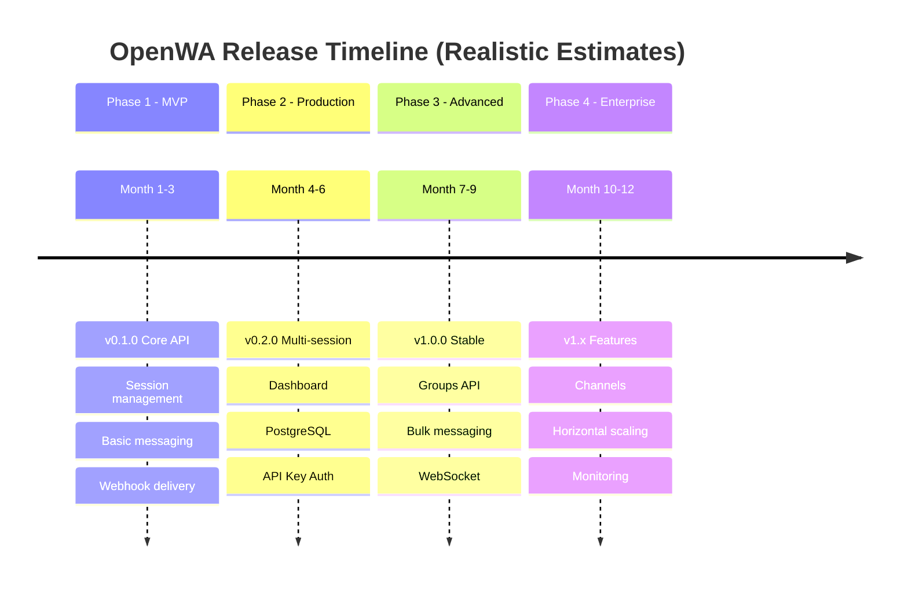
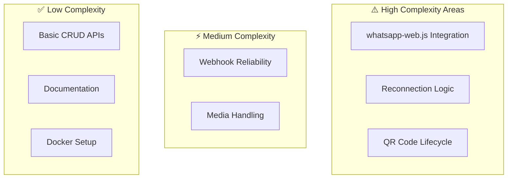
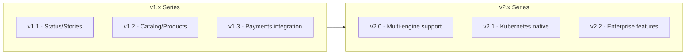
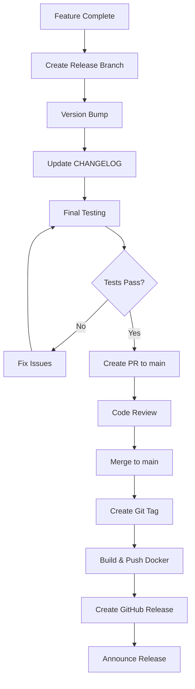

# 09 - Project Roadmap

## 9.1 Release Strategy



### Timeline Rationale

| Phase | Original | Adjusted | Reason |
|-------|----------|----------|--------|
| Phase 1 | 2 months | 3 months | whatsapp-web.js integration complexity, testing stability |
| Phase 2 | 2 months | 3 months | Dashboard development, multi-session architecture |
| Phase 3 | 2 months | 3 months | Groups API complexity, WebSocket implementation |
| Phase 4 | - | 3 months | New phase for enterprise features |

### Risk Buffer

Each phase includes a 2–3 week buffer for:
- Bug fixing and stabilization
- WhatsApp protocol changes
- Community feedback integration
- Documentation updates

### Prerequisites & Resources

| Requirement | Details |
|-------------|---------|
| **Development** | 1-2 full-time developers (or equivalent part-time) |
| **Environment** | Node.js 20 LTS, Docker, Git |
| **Testing** | WhatsApp test accounts (2-3 numbers) |
| **Infrastructure** | VPS for staging (2GB RAM minimum) |
| **Accounts** | GitHub organization, npm registry access, Docker Hub/GHCR |

## 9.2 Version Numbering

```
MAJOR.MINOR.PATCH

MAJOR: Breaking changes
MINOR: New features (backward compatible)
PATCH: Bug fixes

Examples:
0.1.0 - Initial MVP
0.2.0 - Multi-session support
0.2.1 - Bug fix for QR timeout
1.0.0 - First stable release
1.1.0 - Groups API added
2.0.0 - Breaking API changes
```

## 9.3 Phase 1: MVP (Month 1-3)

### Goals
- Working single-session API
- Basic send/receive functionality
- Docker deployment ready
- Stable WhatsApp connection

### Milestones



```mermaid
gantt
    title Phase 1 - MVP (12 weeks)
    dateFormat  X
    axisFormat Week %W

    section Foundation (Week 1-2)
    Project setup           :done, p1-1, 0, 5d
    Database schema         :done, p1-2, after p1-1, 3d
    Basic NestJS structure  :done, p1-3, after p1-2, 4d

    section WhatsApp Engine (Week 3-5)
    Engine abstraction layer :p1-4, after p1-3, 3d
    whatsapp-web.js wrapper  :p1-5, after p1-4, 7d
    Connection management    :p1-6, after p1-5, 4d
    QR code handling         :p1-7, after p1-6, 3d

    section Session (Week 6-7)
    Session entity & CRUD    :p1-8, after p1-7, 4d
    Session persistence      :p1-9, after p1-8, 4d
    Auto-reconnect logic     :p1-10, after p1-9, 3d

    section Messaging (Week 8-9)
    Send text message        :p1-11, after p1-10, 3d
    Send image               :p1-12, after p1-11, 2d
    Send video/audio         :p1-13, after p1-12, 3d
    Send document            :p1-14, after p1-13, 2d

    section Webhook (Week 10)
    Receive messages event   :p1-15, after p1-14, 2d
    Webhook delivery         :p1-16, after p1-15, 3d
    Retry mechanism          :p1-17, after p1-16, 2d

    section Infrastructure (Week 10-11)
    Docker setup             :p1-18, after p1-3, 3d
    CI/CD pipeline           :p1-18b, after p1-18, 3d
    Swagger documentation    :p1-19, after p1-17, 2d
    Health endpoints         :p1-20, after p1-19, 1d
    Basic logging            :p1-21, after p1-20, 2d

    section Stabilization (Week 12)
    Integration testing      :p1-22, after p1-21, 3d
    Bug fixes                :p1-23, after p1-22, 3d
    Documentation            :p1-24, after p1-23, 2d
    v0.1.0 Release           :milestone, p1-25, after p1-24, 0d
```

### Complexity Notes



| Area | Complexity | Time Buffer |
|------|------------|-------------|
| whatsapp-web.js integration | High | +1 week |
| Connection stability | High | +1 week |
| Media handling | Medium | +3 days |
| Webhook delivery | Medium | +3 days |

### v0.1.0 Features

| Feature | Priority | Status |
|---------|----------|--------|
| Create session | P0 | 🔲 |
| Delete session | P0 | 🔲 |
| Get session status | P0 | 🔲 |
| Generate QR code | P0 | 🔲 |
| Send text message | P0 | 🔲 |
| Send image | P0 | 🔲 |
| Send video | P1 | 🔲 |
| Send audio | P1 | 🔲 |
| Send document | P1 | 🔲 |
| Receive messages | P0 | 🔲 |
| Webhook delivery | P0 | 🔲 |
| Swagger docs | P0 | 🔲 |
| Docker support | P0 | 🔲 |
| CI/CD pipeline | P0 | 🔲 |
| Health check | P1 | 🔲 |
| SQLite storage | P0 | 🔲 |

### Deliverables

```
v0.1.0 Release Package:
├── Docker image (ghcr.io/rmyndharis/openwa:0.1.0)
├── docker-compose.yml
├── API documentation (Swagger)
├── README with quick start
├── Basic examples
└── CI/CD workflows (GitHub Actions)
    ├── Build & test pipeline
    ├── Docker image build & push
    └── Release automation
```

## 9.4 Phase 2: Production Ready (Month 4-6)

### Goals
- Multi-session support
- Web dashboard
- Production-grade security
- Database scalability

### Milestones



```mermaid
gantt
    title Phase 2 - Production Ready (12 weeks)
    dateFormat  X
    axisFormat Week %W

    section Multi-session (Week 1-3)
    Session manager redesign    :p2-1, 0, 5d
    Memory management           :p2-2, after p2-1, 4d
    Concurrent sessions         :p2-3, after p2-2, 4d
    Session isolation           :p2-4, after p2-3, 3d
    Resource quotas             :p2-5, after p2-4, 3d

    section Database (Week 4-5)
    PostgreSQL adapter          :p2-6, 0, 4d
    Migration system            :p2-7, after p2-6, 3d
    Connection pooling          :p2-8, after p2-7, 2d
    Table partitioning          :p2-9, after p2-8, 3d

    section Security (Week 5-7)
    API key system              :p2-10, after p2-5, 4d
    Permission model            :p2-11, after p2-10, 3d
    Rate limiting               :p2-12, after p2-11, 3d
    IP whitelisting             :p2-13, after p2-12, 2d
    Audit logging               :p2-14, after p2-13, 3d

    section Queue System (Week 6-7)
    Redis integration           :p2-15, after p2-9, 3d
    Bull queue setup            :p2-16, after p2-15, 3d
    Webhook queue               :p2-17, after p2-16, 2d
    Message queue               :p2-18, after p2-17, 2d

    section Dashboard (Week 8-10)
    React + shadcn/ui setup     :p2-19, after p2-18, 3d
    Authentication UI           :p2-20, after p2-19, 3d
    Session management          :p2-21, after p2-20, 4d
    QR code display             :p2-22, after p2-21, 2d
    Webhook management          :p2-23, after p2-22, 4d
    Logs viewer                 :p2-24, after p2-23, 3d
    Test message sender         :p2-25, after p2-24, 2d

    section Stabilization (Week 11-12)
    Load testing                :p2-26, after p2-25, 3d
    Security audit              :p2-27, after p2-26, 3d
    Performance tuning          :p2-28, after p2-27, 3d
    v0.2.0 Release              :milestone, p2-29, after p2-28, 0d
```

### v0.2.0 Features

| Feature | Priority | Status |
|---------|----------|--------|
| Multi-session support | P0 | 🔲 |
| PostgreSQL support | P0 | 🔲 |
| API key authentication | P0 | 🔲 |
| Rate limiting | P0 | 🔲 |
| Permission system | P1 | 🔲 |
| Web dashboard | P0 | 🔲 |
| Webhook management UI | P1 | 🔲 |
| Redis cache | P1 | 🔲 |
| Job queue | P1 | 🔲 |
| Webhook retry | P0 | 🔲 |
| Session auto-reconnect | P1 | 🔲 |
| Contact list API | P1 | 🔲 |
| Message history | P2 | 🔲 |

## 9.5 Phase 3: Advanced Features (Month 7-9)

### Goals
- Complete feature parity with WAHA Plus
- Stable v1.0.0 release
- Community adoption

### Milestones



```mermaid
gantt
    title Phase 3 - Advanced Features (12 weeks)
    dateFormat  X
    axisFormat Week %W

    section Groups (Week 1-2)
    Get groups list         :p3-1, 0, 2d
    Group info & members    :p3-2, after p3-1, 2d
    Create group            :p3-3, after p3-2, 2d
    Manage participants     :p3-4, after p3-3, 3d
    Group settings          :p3-5, after p3-4, 2d

    section Channels (Week 3-4)
    Channel list            :p3-6, 0, 2d
    Channel messages        :p3-7, after p3-6, 3d
    Create channel          :p3-8, after p3-7, 2d

    section Advanced Messages (Week 5-6)
    Send location           :p3-9, after p3-5, 1d
    Send contact            :p3-10, after p3-9, 1d
    Send sticker            :p3-11, after p3-10, 2d
    Message reactions       :p3-12, after p3-11, 1d
    Reply to message        :p3-13, after p3-12, 1d
    Forward message         :p3-14, after p3-13, 1d

    section Scaling (Week 7-8)
    Horizontal scaling docs :p3-15, after p3-8, 3d
    Session affinity        :p3-16, after p3-15, 2d
    Load testing            :p3-17, after p3-16, 2d

    section Community (Week 9-10)
    n8n community node      :p3-18, after p3-17, 3d
    Example projects        :p3-19, after p3-18, 2d
    Video tutorials         :p3-20, after p3-19, 3d

    section Release (Week 11-12)
    Security audit          :p3-21, after p3-20, 3d
    Performance tuning      :p3-22, after p3-21, 2d
    v1.0.0 Release          :milestone, p3-23, after p3-22, 0d
```

### v1.0.0 Features

| Feature | Priority | Status |
|---------|----------|--------|
| Groups API (full) | P0 | 🔲 |
| Channels/Newsletter | P1 | 🔲 |
| Labels management | P2 | 🔲 |
| Send location | P1 | 🔲 |
| Send contact | P1 | 🔲 |
| Send sticker | P2 | 🔲 |
| Message reactions | P2 | 🔲 |
| Reply/Forward | P1 | 🔲 |
| Proxy per session | P1 | 🔲 |
| n8n integration | P1 | 🔲 |
| Horizontal scaling | P2 | 🔲 |
| Security audit | P0 | 🔲 |

## 9.6 Future Roadmap (v1.x+)



### Potential Future Features

| Feature | Version | Description |
|---------|---------|-------------|
| Status/Stories | v1.1 | Post and view status updates |
| Catalog API | v1.2 | Product catalog management |
| Payment links | v1.3 | WhatsApp Pay integration |
| Baileys engine | v2.0 | Alternative lightweight engine |
| Kubernetes operator | v2.1 | Native K8s deployment |
| Multi-tenant | v2.2 | Enterprise SaaS features |
| Encryption at rest | v2.2 | Full data encryption |
| Audit compliance | v2.2 | SOC2, GDPR compliance |

## 9.7 Release Checklist

### Pre-Release

```markdown
## Pre-Release Checklist

### Code Quality
- [ ] All tests passing
- [ ] Code coverage > 80%
- [ ] No critical linter warnings
- [ ] Security scan passed
- [ ] Dependency audit clean

### Documentation
- [ ] API docs updated
- [ ] CHANGELOG updated
- [ ] README updated
- [ ] Migration guide (if breaking)

### Testing
- [ ] Manual QA completed
- [ ] Performance benchmarks
- [ ] Load testing (if applicable)
- [ ] Rollback tested

### Infrastructure
- [ ] Docker image builds
- [ ] Docker Compose tested
- [ ] Environment variables documented
```

### Release Process



## 9.8 Success Metrics

### Phase 1 Success Criteria

| Metric | Target | Type |
|--------|--------|------|
| Core API endpoints working | 100% | Internal |
| Docker deployment works | ✅ | Internal |
| Single session stable | 24+ hours | Internal |
| Message delivery rate | > 95% | Internal |
| API response time | < 500ms | Internal |
| CI/CD pipeline operational | ✅ | Internal |

### Phase 2 Success Criteria

| Metric | Target | Type |
|--------|--------|------|
| Multi-session support | 10+ sessions | Internal |
| Dashboard functional | All features | Internal |
| PostgreSQL stable | ✅ | Internal |
| Webhook delivery rate | > 99% | Internal |
| Test coverage | > 70% | Internal |
| GitHub stars | 100+ | External |

### Phase 3 Success Criteria

| Metric | Target | Type |
|--------|--------|------|
| Feature parity with WAHA Plus | 90%+ | Internal |
| API response time (p95) | < 200ms | Internal |
| Test coverage | > 80% | Internal |
| Documentation coverage | 100% | Internal |
| Production users | 50+ | External |
| GitHub stars | 500+ | External |
| Community contributors | 5+ | External |

---

<div align="center">

[← 08 - Development Guidelines](./08-development-guidelines.md) · [📚 Documentation Index](./README.md) · [10 - Risk Management →](./10-risk-management.md)

</div>
